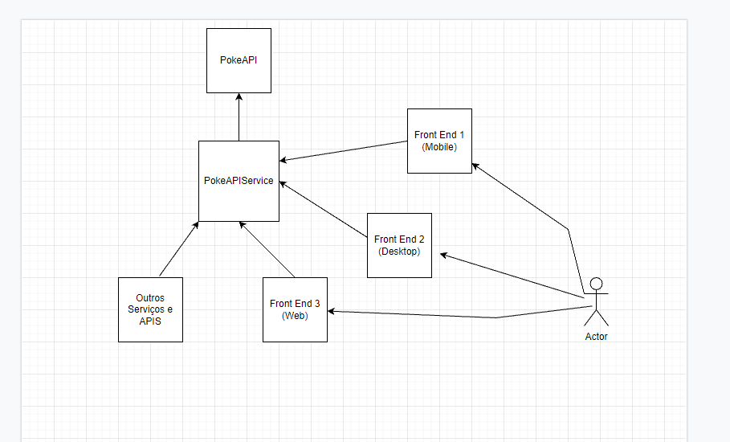

# PokeAPIService
##### API de Pokemons criado para avaliação técnica com base nos requisitos apresentados pela empresa LooqBox

#### [Regras do Desafio](https://github.com/looqbox/looqbox-backend-challenge#readme)

## Instalação e Uso

#### docker:
  * Rodar no Terminal : `docker image build -t poke-api-service .` 
  * Depois : `docker run --name poke-api-service -p 8080:8080 poke-api-service`

#### docker-compose:
  * Rodar no Terminal `docker-compose up -d`
 

## JDK e Dependências
* JDK 17.0.3 LTS
* Spring Boot 2.7.0 (spring-boot-starter-web, spring-boot-devtools,spring-boot-starter-test) 
 
 
## Informações complementares

#### Endpoint principal
* http://localhost:8080/pokemons?name={nome-do-pokemon}
* Exemplo -> http://localhost:8080/pokemons?name=pidge 

### Diagrama Arquitetural

## Observações complementares (decisões de implementação)

* Não usei nenhum tipo de banco de dados, pois na minha opnião não há necessidade com base nos requisitos da aplicação.
* Criei um repositório em memoria para simular um banco de dados de pokemons, uma abordagem mais performatica seria persistir no banco e consultar em operações distintas.
* Não encontrei necessidade de usar outros 'Design Patterns' pelo fato de ser um endpoint simples com uma regra de negocio simples, utilizei **MVC** comum.
* Foram criado Testes unitários e de integração para todas as camadas.

